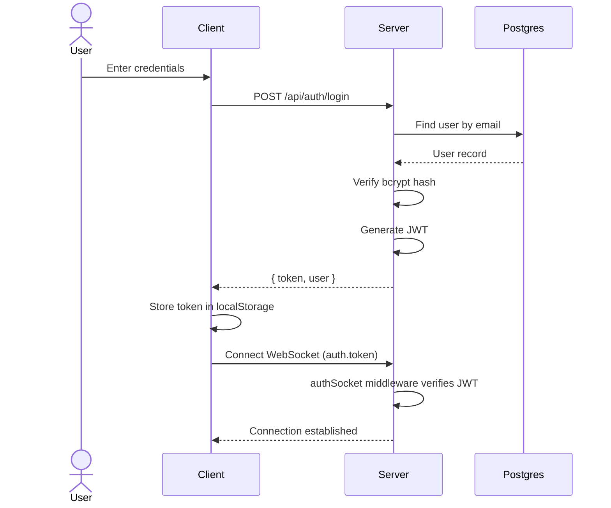
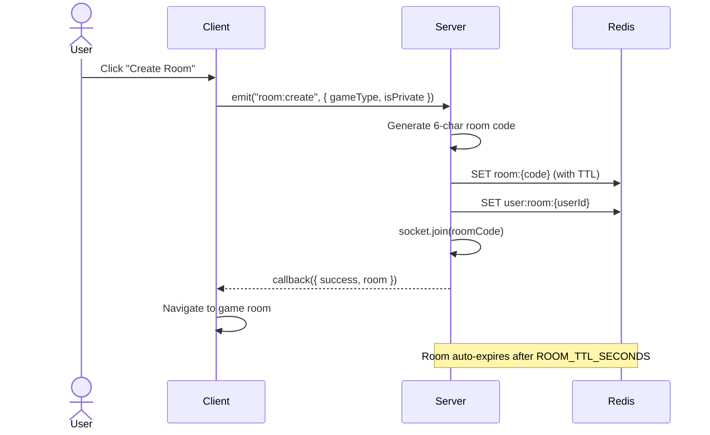
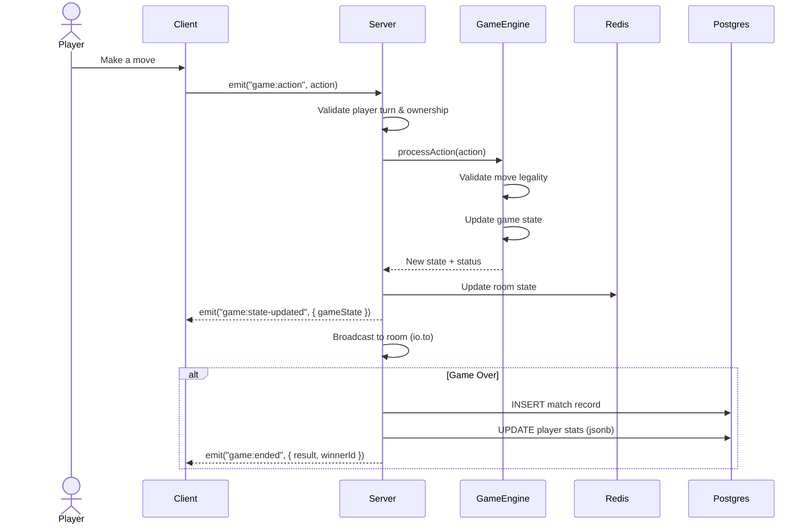
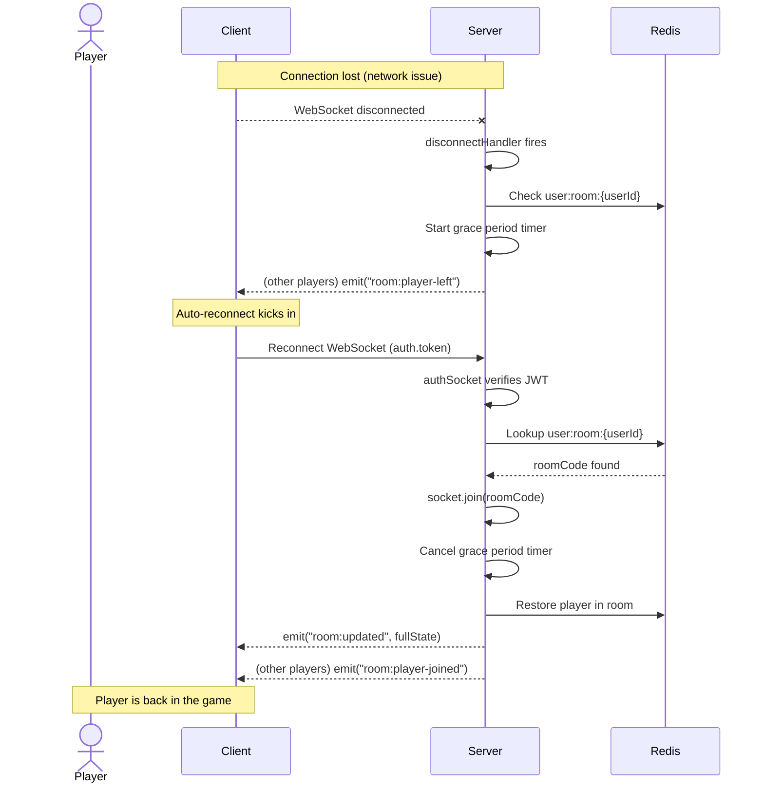

# Multiplayer Game Backend

> Real-time multiplayer game platform with room management, matchmaking, spectators, chat, and leaderboard.


## Demo

> _Link will be added after deployment._

---

## Features

- **Real-Time Multiplayer** — WebSocket-powered gameplay with sub-second latency
- **Room Codes** — Create private/public rooms with unique 6-character codes
- **Matchmaking Queue** — Automatic skill-based opponent matching with estimated wait times
- **Spectator Mode** — Watch live games without interfering
- **In-Game Chat** — Throttled real-time messaging with system announcements
- **Rematch System** — Vote-based rematch flow after game ends
- **Leaderboard** — Global rankings with privacy-respecting stat display
- **Two Games** — Tic-Tac-Toe and a Card Game, extendable via `GameFactory`
- **Admin Panel** — Dashboard, user management, room oversight, match history
- **Guest Mode** — Play instantly without registration (limited features)
- **Profile & Avatar** — Customizable profiles with avatar upload and match history
- **Reconnection** — Automatic rejoin on disconnect with state recovery

---

## Architecture

```
                  ┌─────────────┐
                  │   Client    │  React 19 + Vite + TypeScript
                  │  (Vercel)   │  socket.io-client (typed)
                  └──────┬──────┘
                         │  HTTPS REST + WSS
                         │  (shared/ types ensure contract)
                         ▼
                  ┌─────────────┐
                  │   Server    │  Express 5 + Socket.io 4 + TypeScript
                  │  (Render)   │  Node 20 LTS, compiled to dist/
                  └──┬───────┬──┘
                     │       │
            JWT auth │       │ Drizzle ORM
                     ▼       ▼
              ┌─────────┐ ┌──────────────┐
              │  Redis  │ │   Postgres   │
              │ (Cloud) │ │    (Neon)    │
              │ Rooms,  │ │  Users,      │
              │ Queues, │ │  Matches,    │
              │ TTL     │ │  Stats jsonb │
              └─────────┘ └──────────────┘
```

---

## Roles & Permissions

| Role | Create Room | Play | Spectate | Chat | Matchmaking | Leaderboard | Admin Panel |
|---|---|---|---|---|---|---|---|
| Guest | yes | yes | yes | yes | yes | no | no |
| Player | yes | yes | yes | yes | yes | yes | no |
| Admin | yes | yes | yes | yes | yes | yes | yes |

---

## API Endpoints

### Auth — `/api/auth`

| Method | Path | Auth | Description |
|---|---|---|---|
| `POST` | `/api/auth/register` | — | Register a new user account |
| `POST` | `/api/auth/login` | — | Login with email & password |
| `POST` | `/api/auth/guest` | — | Login as a guest user |
| `GET` | `/api/auth/me` | Registered | Get authenticated user info |
| `PUT` | `/api/auth/me` | Registered | Update profile (displayName, bio) |
| `PUT` | `/api/auth/me/password` | Registered | Change password |
| `DELETE` | `/api/auth/me` | Registered | Delete account (requires password) |

### Users — `/api/users`

| Method | Path | Auth | Description |
|---|---|---|---|
| `GET` | `/api/users/me` | Registered | Get own detailed profile |
| `PATCH` | `/api/users/me` | Registered | Update own profile |
| `POST` | `/api/users/me/avatar` | Registered | Upload avatar image |
| `DELETE` | `/api/users/me/avatar` | Registered | Remove avatar |
| `PATCH` | `/api/users/me/preferences` | Registered | Update privacy/notification preferences |
| `GET` | `/api/users/:username` | Optional | Get public profile by username |
| `GET` | `/api/users/:username/matches` | Optional | Get user's match history (paginated) |

### Matches — `/api/matches`

| Method | Path | Auth | Description |
|---|---|---|---|
| `GET` | `/api/matches` | Optional | List recent matches (paginated, filterable) |
| `GET` | `/api/matches/:id` | Optional | Get match details by ID |

### Leaderboard — `/api/leaderboard`

| Method | Path | Auth | Description |
|---|---|---|---|
| `GET` | `/api/leaderboard` | Optional | Get global leaderboard (paginated) |

### Admin — `/api/admin`

| Method | Path | Auth | Description |
|---|---|---|---|
| `GET` | `/api/admin/stats` | Admin | Get dashboard statistics |
| `GET` | `/api/admin/users` | Admin | List all users (search, paginate) |
| `GET` | `/api/admin/users/:id` | Admin | Get user details by ID |
| `PATCH` | `/api/admin/users/:id/role` | Admin | Update user role |
| `DELETE` | `/api/admin/users/:id` | Admin | Delete a user |
| `GET` | `/api/admin/rooms` | Admin | List active rooms |
| `DELETE` | `/api/admin/rooms/:roomCode` | Admin | Force-close a room |
| `GET` | `/api/admin/matches` | Admin | List recent matches (admin view) |

### Health

| Method | Path | Auth | Description |
|---|---|---|---|
| `GET` | `/api/health` | — | Health check (DB + Redis status) |

---

## Socket Events

### Client → Server

| Event | Payload | Description |
|---|---|---|
| `room:create` | `{ gameType, isPrivate }` | Create a new game room |
| `room:join` | `{ roomCode, asSpectator? }` | Join an existing room |
| `room:leave` | — | Leave the current room |
| `room:ready` | — | Toggle ready status |
| `room:start` | — | Host starts the game |
| `room:spectate` | `{ roomCode }` | Join room as spectator |
| `game:action` | `GameAction` | Submit a game move |
| `game:rematch-request` | — | Request a rematch |
| `game:rematch-accept` | — | Accept rematch request |
| `game:rematch-decline` | — | Decline rematch request |
| `chat:message` | `{ message }` | Send a chat message |
| `matchmaking:join` | `{ gameType }` | Enter matchmaking queue |
| `matchmaking:leave` | — | Leave matchmaking queue |

### Server → Client

| Event | Payload | Description |
|---|---|---|
| `room:updated` | `Room` | Full room state update |
| `room:player-joined` | `RoomPlayer` | A player joined the room |
| `room:player-left` | `{ playerId, newHostId? }` | A player left the room |
| `room:kicked` | `{ reason }` | You were kicked from the room |
| `room:closed` | — | The room has been closed |
| `game:started` | `{ roomCode, gameState }` | Game has started |
| `game:state-updated` | `{ roomCode, gameState }` | Game state changed |
| `game:turn` | `{ roomCode, currentPlayerId }` | It's someone's turn |
| `game:ended` | `{ roomCode, result, winnerId, … }` | Game finished |
| `game:rematch-requested` | `{ userId, votes }` | Someone requested rematch |
| `game:rematch-accepted` | `{ userId, votes }` | Someone accepted rematch |
| `game:rematch-declined` | `{ userId }` | Someone declined rematch |
| `game:timer-update` | `{ playerId, remainingMs }` | Turn timer tick |
| `chat:message` | `{ senderId, senderName, message, timestamp }` | Chat message received |
| `chat:system` | `{ message, timestamp }` | System announcement |
| `matchmaking:searching` | `{ gameType, estimatedWait }` | Entered matchmaking queue |
| `matchmaking:found` | `{ roomCode }` | Match found, room created |
| `matchmaking:cancelled` | — | Matchmaking cancelled |
| `user:online-status` | `{ userId, isOnline }` | User online/offline update |
| `error` | `{ message, code? }` | Error notification |

---

## Folder Structure

```
├── server/
│   ├── src/
│   │   ├── config/          # env, redis, corsOptions
│   │   ├── controllers/     # authController, userController, adminController, matchController, leaderboardController
│   │   ├── db/              # Drizzle client, schema, migrations
│   │   │   └── schema/      # Drizzle table definitions
│   │   ├── games/           # BaseGame, TicTacToe, CardGame, GameFactory
│   │   ├── middleware/      # authMiddleware, errorHandler, rateLimiters, sanitize, upload, validate
│   │   ├── routes/          # authRoutes, userRoutes, adminRoutes, matchRoutes, leaderboardRoutes
│   │   ├── seed/            # seedAdmin script
│   │   ├── services/        # roomService, matchService, matchmakingService, userService
│   │   ├── socket/          # index, io, authSocket, roomHandlers, gameHandlers, chatHandlers, matchmakingHandlers, disconnectHandlers
│   │   ├── types/           # express.d.ts augmentation
│   │   ├── utils/           # logger, apiResponse, constants, generateRoomCode, generateToken, escapeHtml, escapeRegex, shuffle, deck
│   │   ├── validators/      # authValidators, userValidators, adminValidators, matchValidators, leaderboardValidators, socketValidators
│   │   ├── __fixtures__/    # test fixtures (matches, tokens, players)
│   │   ├── __tests__/       # integration tests (auth, room, game, chat, matchmaking, spectator, disconnect, security, admin, guest)
│   │   └── server.ts        # Express + Socket.io bootstrap
│   ├── drizzle/             # Generated SQL migration files
│   ├── package.json
│   └── tsconfig.json
│
├── client/
│   ├── src/
│   │   ├── api/             # axios instance, authService, userService, matchService, leaderboardService, adminService
│   │   ├── components/
│   │   │   ├── game/        # ChatPanel, PlayerList, SpectatorList, RematchPrompt, TurnIndicator, GameBoardFrame, MobileTabBar
│   │   │   ├── games/       # TicTacToeBoard, CardGameTable
│   │   │   ├── guards/      # ProtectedRoute, AdminRoute, GuestOnlyRoute, RegisteredOnlyRoute
│   │   │   ├── layout/      # Navbar, MainLayout, AdminLayout, SettingsLayout, Footer
│   │   │   ├── profile/     # ProfileHeader, GameStatsCard, MatchList
│   │   │   ├── system/      # ConnectionBanner
│   │   │   └── ui/          # Button, Input, Modal, Card, Badge, Spinner, Avatar, Tooltip, Tabs, Select, etc.
│   │   ├── context/         # AuthContext, SocketContext, PreferencesContext
│   │   ├── hooks/           # useSocketEvent, useLocalStorage, useDebounce, useSounds, useAnimations, usePageFocus
│   │   ├── pages/
│   │   │   ├── admin/       # AdminDashboard, AdminUsers, AdminMatches, AdminRooms
│   │   │   ├── settings/    # ProfileSettings, AccountSettings, PrivacySettings, NotificationSettings, AppearanceSettings
│   │   │   ├── HomePage, LoginPage, RegisterPage, GuestEntryPage
│   │   │   ├── GameRoomPage, LeaderboardPage
│   │   │   ├── MyProfilePage, PublicProfilePage
│   │   │   └── NotFoundPage
│   │   ├── socket/          # socket instance, typed events
│   │   ├── utils/           # cn, constants, helpers, formatDate, flipAnimation
│   │   ├── App.tsx          # Router & route definitions
│   │   └── main.tsx         # React entry point
│   ├── package.json
│   └── tsconfig.json
│
├── shared/
│   └── types/
│       ├── auth.ts          # AuthUser, JwtPayload, TokenPair
│       ├── user.ts          # User, PublicUser, UserPreferences
│       ├── room.ts          # Room, RoomPlayer, RoomStatus
│       ├── games.ts         # GameState, GameAction, GameType
│       ├── match.ts         # Match, MatchPlayer, MatchResult
│       ├── events.ts        # ClientToServerEvents, ServerToClientEvents, SocketData
│       └── api.ts           # ApiResponse, PaginatedResponse, ErrorResponse
│
├── docs/
│   └── build-guide.md
└── README.md
```

---

## Security

The project follows a comprehensive security audit (see Step 27 in `docs/build-guide.md`):

- **Mass Assignment Protection** — Controllers destructure only allowed fields; no `req.body` spread
- **Role Protection** — `role` field not settable via public endpoints; only admin can change roles
- **User Enumeration Prevention** — Identical error messages for wrong email vs. wrong password
- **Password Security** — bcrypt hashing (12 rounds), `select: false`, change requires current password
- **JWT Hardening** — Secret length ≥ 32 chars enforced in production; guest tokens TTL ≤ 2h
- **Rate Limiting** — Separate limiters for global, auth, admin, and upload routes
- **Helmet** — Default safe HTTP headers enabled
- **CORS** — Strict specific origin from `CLIENT_ORIGIN`; never `*` in production
- **Body Size Limits** — `express.json({ limit: '10kb' })`, Socket.io `maxHttpBufferSize: 1e5`
- **SQL Injection Prevention** — Drizzle + parameterized queries; zero raw string interpolation
- **Prototype Pollution Protection** — `sanitizeMiddleware` strips `__proto__`/`constructor`/`prototype` keys
- **XSS Protection** — `escape()` via express-validator on all user text inputs
- **ReDoS Prevention** — `escapeRegex` used on all regex-based user searches
- **Ownership Checks** — Game actions verify socket user is a current player
- **Spectator Restrictions** — Spectators blocked from game actions; hidden info (card hands) not exposed
- **Admin Self-Protection** — Cannot delete self, cannot change own role, last-admin guard
- **Pagination Clamping** — `limit ≤ 100` (leaderboard), `≤ 50` (matches/users)
- **File Upload Safety** — MIME whitelist (jpeg/png/webp), 5 MB cap, server-generated filenames
- **Error Handler** — Never exposes stack traces or internal paths in production
- **Privacy Controls** — `showStats` and `showOnLeaderboard` preferences enforced server-side
- **`x-powered-by` Disabled**
- **No Secret Logging** — No `console.log` of tokens, hashes, or PII in production
- **Typed Sockets** — `Server<ClientToServerEvents, ServerToClientEvents>` ensures payload safety at compile time

---

## Getting Started

### Prerequisites

- **Node.js** 20 LTS or higher
- **PostgreSQL** (local or [Neon](https://neon.tech))
- **Redis** (local or cloud)
- **Git**

### Installation

```bash
# Clone the repository
git clone https://github.com/<your-username>/multiplayer-game-backend.git
cd multiplayer-game-backend

# Install server dependencies
cd server
npm install

# Install client dependencies
cd ../client
npm install

# Install shared dependencies
cd ../shared
npm install
```

### Environment Setup

Copy the example environment files and fill in your values:

```bash
cp server/.env.example server/.env
cp client/.env.example client/.env
```

### Database Setup

```bash
# Generate migration files (if schema changed)
cd server
npm run db:generate

# Run migrations
npm run db:migrate

# Seed admin user
npm run seed:admin
```

### Run Development Servers

```bash
# Terminal 1 — Server (port 5000)
cd server
npm run dev

# Terminal 2 — Client (port 5173)
cd client
npm run dev
```

### Run Tests

```bash
# Server unit tests
cd server
npm run test:run

# Server integration tests
npm run test:integration

# All server tests
npm run test:all

# Client tests
cd client
npm run test:run

# With coverage
npm run test:coverage
```

---

## Environment Variables

### Server (`server/.env`)

| Variable | Description | Default |
|---|---|---|
| `NODE_ENV` | Environment (`development` / `production` / `test`) | `development` |
| `PORT` | Server port | `5000` |
| `DATABASE_URL` | PostgreSQL connection string | — |
| `REDIS_URL` | Redis connection string | `redis://localhost:6379` |
| `JWT_SECRET` | JWT signing secret (≥ 32 chars in prod) | — |
| `JWT_EXPIRES_IN` | JWT token expiry | `7d` |
| `GUEST_JWT_EXPIRES_IN` | Guest token expiry | `2h` |
| `CLIENT_ORIGIN` | Allowed CORS origin | `http://localhost:5173` |
| `ROOM_TTL_SECONDS` | Room TTL in Redis | `7200` |
| `MATCHMAKING_TTL_SECONDS` | Matchmaking queue TTL | `300` |
| `BCRYPT_SALT_ROUNDS` | bcrypt hash rounds | `12` |
| `UPLOAD_MAX_BYTES` | Max avatar upload size | `5242880` |
| `ADMIN_USERNAME` | Initial admin username | `admin` |
| `ADMIN_EMAIL` | Initial admin email | — |
| `ADMIN_PASSWORD` | Initial admin password | — |

### Client (`client/.env`)

| Variable | Description | Default |
|---|---|---|
| `VITE_API_URL` | Server REST API base URL | `http://localhost:5000/api` |
| `VITE_SOCKET_URL` | Server WebSocket URL | `http://localhost:5000` |

---

## Deployment

- **Server** — Deploy to [Render](https://render.com) as a Web Service. Build command: `npm run build`, start command: `npm start`. Set all server environment variables in the Render dashboard.
- **Client** — Deploy to [Vercel](https://vercel.com). Framework: Vite. Set `VITE_API_URL` and `VITE_SOCKET_URL` to your Render service URL.
- **Database** — [Neon](https://neon.tech) serverless Postgres. Copy the connection string to `DATABASE_URL`.
- **Redis** — Use a managed Redis provider (Upstash, Redis Cloud, etc.). Copy the connection string to `REDIS_URL`.

> See Step 55 in `docs/build-guide.md` for detailed deployment instructions.

---

## Architecture Sequence Diagrams

### Login Flow



### Room Creation Flow



### Game Move Flow



### Disconnect → Reconnect Flow



---

## Troubleshooting

### Render Cold Start

Render free-tier services spin down after inactivity. The first request after idle may take 30–60 seconds. Use the `/api/health` endpoint to warm up the service, or upgrade to a paid plan for always-on.

### Redis Connection Refused

```
Error: connect ECONNREFUSED 127.0.0.1:6379
```

Make sure Redis is running locally (`redis-server`) or your `REDIS_URL` points to a valid cloud instance. On Windows, consider using WSL or Docker for Redis.

### JWT Secret Too Short

```
Error: JWT_SECRET must be at least 32 characters in production
```

The server enforces a minimum secret length in production. Generate a strong secret:

```bash
node -e "console.log(require('crypto').randomBytes(64).toString('hex'))"
```

### Database Connection Failed

Verify your `DATABASE_URL` is correct and the Postgres instance is accessible. For Neon, ensure the connection string includes `?sslmode=require`.

### Port Already in Use

```
Error: listen EADDRINUSE :::5000
```

Another process is using port 5000. Kill it or change the `PORT` in your `.env`.

### Socket.io CORS Error

Ensure `CLIENT_ORIGIN` in your server `.env` exactly matches the client URL (including protocol and port). No trailing slash.

---

## License

[PolyForm Noncommercial 1.0.0](./LICENSE) — Free for non-commercial use. See [LICENSE](./LICENSE) for details.
